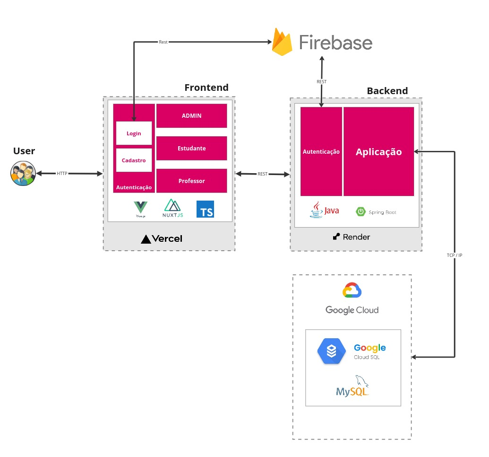

# Demoday
O Demoday é um sistema feito por alunos da UFBA para a disciplina Tópicos em Sistemas de Informação e Web no semestre 2024.1.

## Membros da equipe
Frontend                | Backend       | Testes
---------               |---------      |---------  
Leandro Barbosa         | Samuel Rios   | Júlia Passos
Felipe Angelo           | Paulo Trigo   | Norma Oliveira
.                       | Indaiara Bonfim 
.                       | Reynan da Silva
                        

## Artefatos
* [Deploy do frontend no Vercel](https://demoday-omega.vercel.app/)
* [FIGMA](https://www.figma.com/file/tgBiMAOeOy1C1cPPbGdntX/DEMODAY?type=design&node-id=0-1&mode=design&t=k7Q0p52UdAdfpMsC-0) com design de telas
* [Documento de requisitos](https://docs.google.com/document/d/1WxX1Q8yOPc812UFwMu00FkKZp7S3j5BIyUZi6pdiwp0/edit?tab=t.0#heading=h.op8j48fy8tth)
* [Quadro do Trello](https://trello.com/b/cQF1ZpIU/ic0045)
* [Repositório do backend](https://github.com/samuelrios/demoday-api)
* [Documentação da API](https://demoday-api.onrender.com/swagger-ui/index.html#/)
* [Testes no Notion](https://www.notion.so/Testes-d872b37cd5ac44ed8d1b643eedd14e9a)

## Tecnologias
Frontend      | Backend
---------     |---------
VueJS 3       | Java Spring Boot
Nuxt 3        | Banco de dados MySQL
Node v18.16.0 | .

### Arquitetura do Sistema
